## Практическое задание № 6

## Использование ORM (GORM). Модели, миграции и связи между таблицами.

Студент группы *ЭФМО-02-25 Пягай Даниил Игоревич*

## Описание

**Цели:**

1.	Понять, что такое ORM и чем удобен GORM.
2.	Научиться описывать модели Go-структурами и автоматически создавать таблицы (миграции через AutoMigrate).
3.	Освоить базовые связи: 1:N и M:N + выборки с Preload.
4.	Написать короткий REST (2–3 ручки) для проверки результата.


## Открываем postgres и создаём базу данных (Linux)

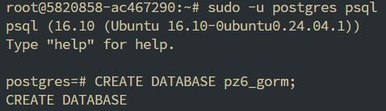

## Инициализация проекта

```bash
mkdir pz6-db && cd pz6-db
go mod init example.com/pz6-gorm
go get gorm.io/gorm gorm.io/driver/postgres github.com/go-chi/chi/v5
```

## Создаём структуру файлов

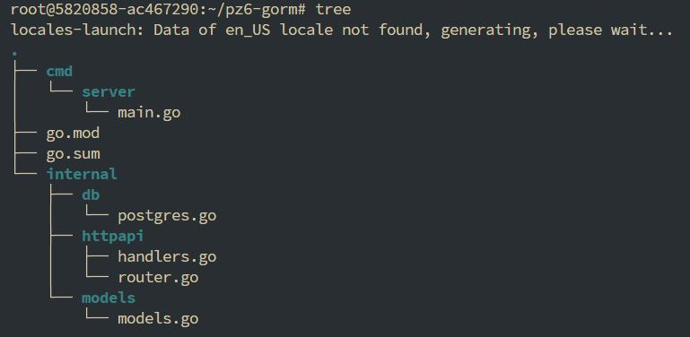

### Содержимое postgres.go
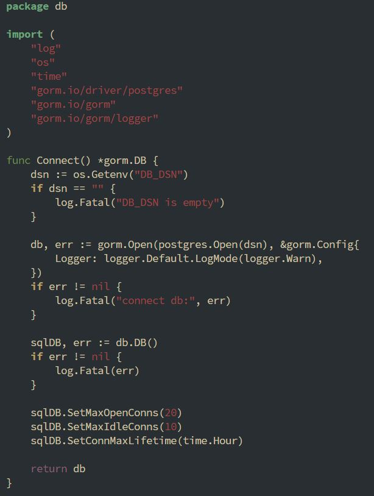

### Содержимое models.go
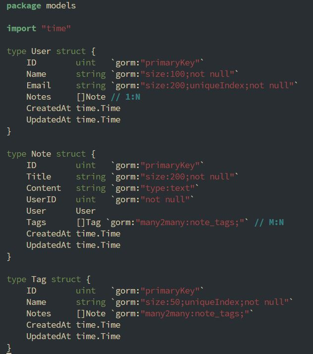

### Содержимое main.go
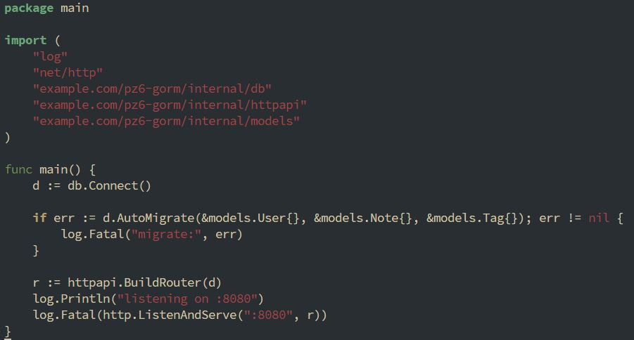

### Содержимое router.go
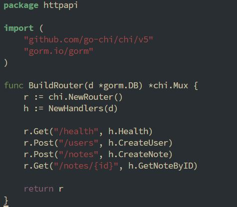

## Содержимое handlers.go
.JPG)
.JPG)
.JPG)
.JPG)

# Запуск и проверка
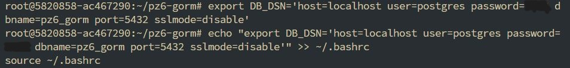
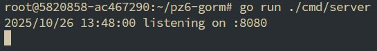

# Проверяем
## здоровье
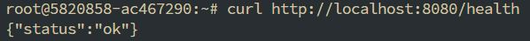
## создаём пользователя
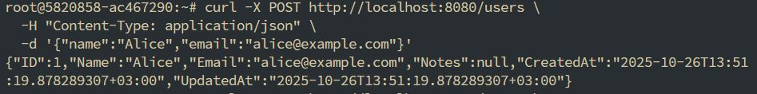
## создаём заметку с тегами
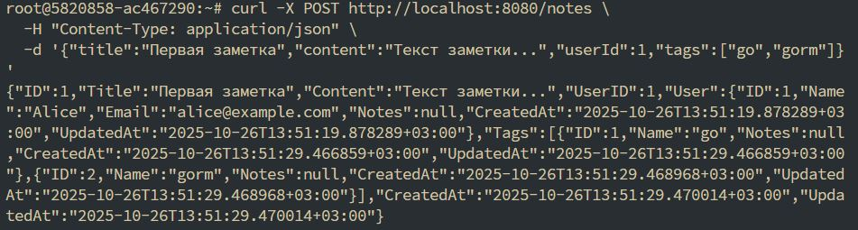
## получаем заметку с автором и тегами
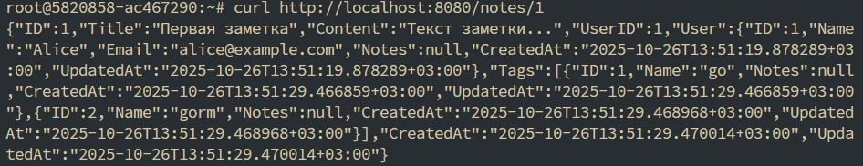
